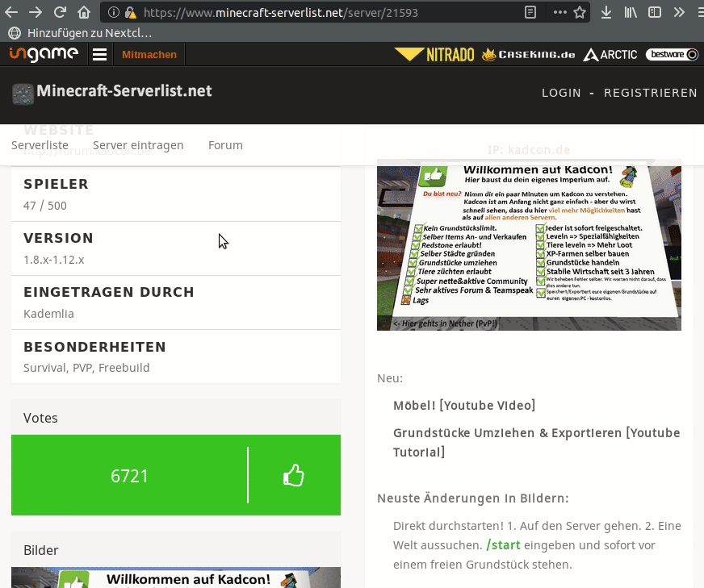
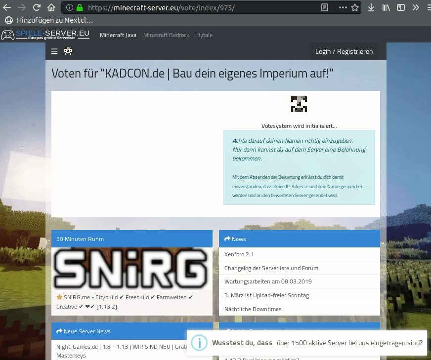

# Name my Vote

A simple firefox extension that automatically fills in your minecraft username on the popular minecraft server lists wiht a vote function. You won't never miss your reward for voting!

Currently supported pages:

- [minecraft-serverlist.net](minecraft-serverlist.net)
- [minecraft-server.eu](minecraft-server.eu)

